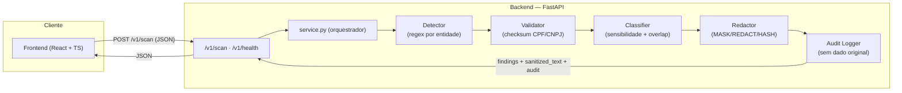

# Data Guardian

Motor de detecção, classificação e mascaramento de dados pessoais, criado para apoiar empresas na conformidade com a LGPD.

Dado um texto de entrada, o Data Guardian identifica dados pessoais (CPF, CNPJ, e-mail, telefone, CEP, cartão de crédito), classifica o nível de sensibilidade de cada um e aplica uma política de mascaramento configurável (`MASK`, `REDACT`, `HASH`) — de forma determinística, auditável e sem persistir o dado original.

## Equipe

| Nome | RA | Frente |
|------|----|--------|
| Marcos André Camargo Belo | 22510865 | Integração Final, Arquitetura e Governança Técnica |
| João Paulo Rodrigues de Oliveira | 22508370 | Testes Finais, Re-especificação e Análise Crítica de IA |
| Pedro Henrique Barbosa | 22503467 | Governança da Sprint e Relato de Experiência |

## Documentação

- Especificação Técnica completa: [`docs/SPECIFICATION.md`](docs/SPECIFICATION.md)
- Divisão de tarefas: [`docs/DIVISAO_DE_TAREFAS.md`](docs/DIVISAO_DE_TAREFAS.md)
- Decisões arquiteturais (ADRs): [`docs/adr/`](docs/adr/)
- Regras do agente de IA (fluxo SDD): [`CLAUDE.md`](CLAUDE.md)

## Stack

- **Backend:** Python 3.11 + FastAPI + Pydantic
- **Frontend:** React + TypeScript + Vite + Tailwind CSS
- **Infraestrutura:** Docker + Docker Compose

## Arquitetura

O sistema é dividido em duas camadas: um frontend de demonstração que consome uma API HTTP, e um backend cujo núcleo é um pipeline de 5 estágios independentes e testáveis isoladamente (ver `docs/SPECIFICATION.md`, seção 8).



Cada estágio do pipeline recebe a saída do anterior e não depende dos demais para ser testado — é o que permite a suíte de testes cobrir `detector`, `validator`, `classifier`, `redactor` e `audit` isoladamente, além do fluxo completo via API (RNF05 da especificação).

## Como rodar o projeto

Pré-requisito: Docker e Docker Compose instalados.

```bash
git clone <URL_DO_REPOSITORIO>
cd DataGuardian
docker-compose up --build
```

- **API (backend):** http://localhost:8000
- **Interface (frontend):** http://localhost:5173

Testando rapidamente a API:
```bash
curl http://localhost:8000/v1/health
```

## Rodando a suíte de testes (Test Harness)

```bash
docker-compose exec backend pytest -v
```

Ou localmente, sem Docker:
```bash
cd backend
pip install -r requirements-dev.txt
pytest -v
```

## Estrutura de branches

- `main` — protegida, apenas via Pull Request aprovado por outro membro.
- `develop` — integração das features antes de ir para `main`.
- `feature/*` — uma branch por tarefa/Issue.

Todo Pull Request segue o template em [`.github/PULL_REQUEST_TEMPLATE.md`](.github/PULL_REQUEST_TEMPLATE.md), com critérios de aceitação explícitos e exige ao menos uma aprovação antes do merge.

## Agentes de IA no fluxo de desenvolvimento

Este projeto segue o fluxo SDD (Spec-Driven Development): toda geração de código com IA parte da especificação em `docs/SPECIFICATION.md`. As regras de contexto do agente estão versionadas em [`CLAUDE.md`](CLAUDE.md).

## Registro de Decisões Arquiteturais (ADRs)

| ADR | Título | Status |
|-----|--------|--------|
| [0001](docs/adr/0001-deteccao-deterministica.md) | Detecção via regras determinísticas (não ML) na v1 | Aceita |
| [0002](docs/adr/0002-stack-tecnologica.md) | Escolha da stack tecnológica | Aceita |
| [0003](docs/adr/0003-consolidacao-dependencias.md) | Consolidação das dependências Python em um único arquivo | Aceita |

Justificativas completas e trade-offs de cada decisão estão nos arquivos individuais linkados acima.
